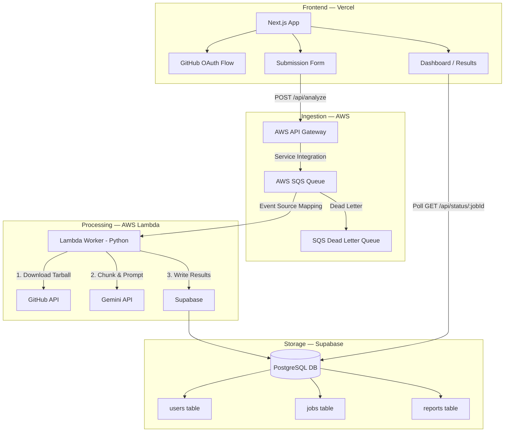
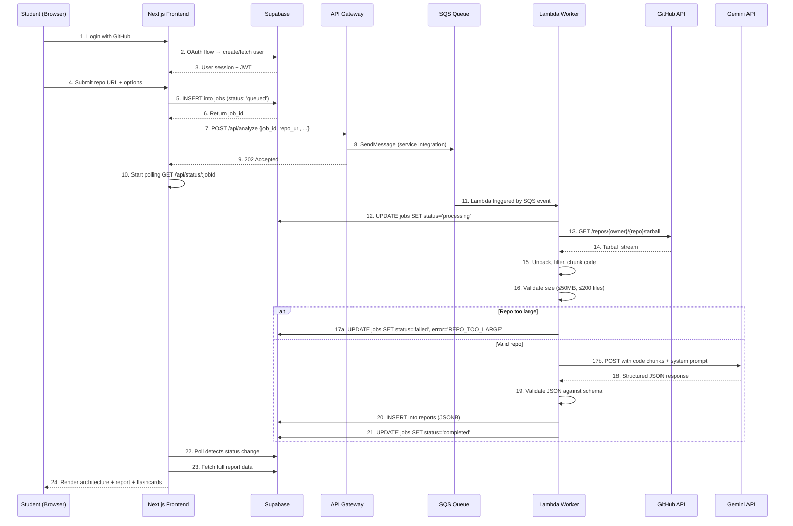
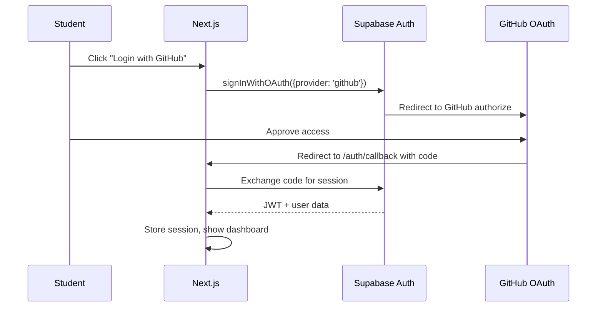

# VERA (Viva Evaluation and Report Automator) — Master Blueprint v2.0

**Project Codename:** VERA
**Lead Architect:** Shardul Chogale
**Document Version:** 2.1 (APPROVED — All decisions locked)
**Last Updated:** 2026-06-20
**Status:** ✅ APPROVED
**Target Users:** Computer Engineering students at VIT Mumbai and other universities

---

> [!IMPORTANT]
> This document is the **single source of truth** for the project. All architectural decisions, trade-offs, and scope boundaries are locked in here. Any deviation must be discussed and documented before implementation.

---

## Table of Contents

1. [Executive Summary](#1-executive-summary)
2. [Decision Log](#2-decision-log)
3. [V1 Scope & Non-Goals](#3-v1-scope--non-goals)
4. [System Architecture](#4-system-architecture)
5. [Tech Stack Matrix (Final)](#5-tech-stack-matrix-final)
6. [Monorepo Structure](#6-monorepo-structure)
7. [Data Flow — End-to-End Lifecycle](#7-data-flow--end-to-end-lifecycle)
8. [Database Schema](#8-database-schema)
9. [API Contracts](#9-api-contracts)
10. [Lambda Worker — Execution Flow](#10-lambda-worker--execution-flow)
11. [AI Prompt Engineering](#11-ai-prompt-engineering)
12. [Error Handling & Edge Cases](#12-error-handling--edge-cases)
13. [Security Model](#13-security-model)
14. [Infrastructure as Code (AWS SAM)](#14-infrastructure-as-code-aws-sam)
15. [Risk Register](#15-risk-register)
16. [V2 & V3 Roadmap](#16-v2--v3-roadmap)
17. [Implementation Phases](#17-implementation-phases)
18. [Verification Plan](#18-verification-plan)

---

## 1. Executive Summary

**What we're building:** A web application that takes a public GitHub repository URL, asynchronously analyzes the codebase using Google's Gemini AI, and produces:
1. A tabular architecture breakdown
2. A structured project report
3. Targeted Viva preparation flashcards

**Why it matters:** Students spend hours manually preparing project reports and Viva answers. This tool automates both, letting them focus on understanding their code rather than formatting documents.

**Key V1 constraints:**
- Public repos only (private repo support in V2)
- English output only
- Repos ≤ 50MB compressed / ≤ 200 code files
- Languages: C, C++, Java, Python, JavaScript/TypeScript

---

## 2. Decision Log

Every architectural decision made during the engineering review, with alternatives considered and rationale.

| # | Decision | Alternatives Considered | Rationale |
|---|----------|------------------------|-----------|
| D1 | **Simple polling** (3–5 sec) for job status | Supabase Realtime, AWS API Gateway WebSockets | Simplest to implement for V1. Supabase Realtime is the upgrade path for V2 if polling feels sluggish. Avoids WebSocket connection management complexity. |
| D2 | **GitHub OAuth** for authentication | Supabase email/password auth, anonymous with rate limiting | Sets up V2 private repo support early. Also provides identity-based rate limiting and ties submissions to user accounts. Students already have GitHub accounts. |
| D3 | **Hard reject** repos over size threshold | Chunked multi-invocation processing, ECS Fargate | YAGNI — most student repos are well under 50MB. Avoids Lambda orchestration complexity. Clear error messaging prevents confusion. |
| D4 | **Supabase `jobs` table** for state tracking | SQS message attributes only, dual tracking | Single source of truth. Frontend polls this table. Persists state after SQS message is consumed. Enables job history and analytics. |
| D5 | **Gemini API via REST** (Google AI Studio key) | Vertex AI with GCP service accounts | Same model (Gemini 2.5 Flash-Lite), drastically simpler auth (API key vs. IAM), no GCP project setup required. Migrating to Vertex AI later is trivial. |
| D6 | **AWS SAM** for Infrastructure as Code | Terraform, AWS CDK, manual console | AWS-native, tight Lambda/SQS/API Gateway integration, YAML templates are easy to explain in a Viva, good resume signal for serverless expertise. |
| D7 | **Enforced JSON schema** for AI output | Markdown parsing, chained API calls | Gemini's `response_mime_type: 'application/json'` with `response_schema` guarantees valid, parseable JSON. Eliminates fragile regex/string parsing. |
| D8 | **English only** for V1 | Multi-language, auto-detect | Reduces prompt complexity. Indian university Vivas are conducted in English. Internationalization is a V2+ feature. |
| D9 | **KMS-encrypted Lambda env vars** for secrets | AWS Secrets Manager, hardcoded .env | Right balance of security and simplicity for V1. No rotation needed at this scale. Secrets Manager adds cost for marginal benefit. |
| D10 | **Monorepo** structure | Polyrepo (separate frontend/backend/infra repos) | Single `git clone` for demos. Easier CI/CD coordination. Better Viva presentation — evaluator sees the entire system in one place. |
| D11 | **5 languages** supported in V1 | All languages with auto-detection, only 4 (C/C++/Java/Python) | Adding JS/TS covers web-based student projects. Auto-detection adds parsing complexity without clear V1 value. |
| D12 | **50MB / 200 files** repo size limit | 25MB/100 (too restrictive), 100MB/500 (risky for Lambda) | Covers 95%+ of student projects. Leaves headroom for framework boilerplate while staying safe within Lambda's /tmp constraints. |
| D13 | **Comprehensive error states** in UI | Generic error messages, email notifications | Students need to understand *why* a submission failed to fix it. "Repo too large" vs. "Invalid URL" vs. "AI timeout" are actionable errors. |
| D14 | **20 analyses/day per-user limit** | No daily cap, 10/day (too restrictive), 50/day (too generous) | Prevents a single user scripting 500 overnight requests. Enforced by counting `jobs` rows for current date before SQS enqueue. Combined with 5 concurrent cap. |
| D15 | **Dedicated bot GitHub PAT** (`viva-prep-bot` account) | User's own OAuth token passed to Lambda, shared personal PAT | Avoids securely passing/refreshing user OAuth tokens across cloud boundaries. V1 is public repos only, so a single bot PAT with 5,000 req/hr is sufficient. User-specific tokens deferred to V2 (private repos). |
| D16 | **Fixed 10 Viva flashcards** (not configurable) | User-selectable 5/10/20 count | Every config option adds frontend state, API schema changes, and prompt complexity. Hardcoding to 10 keeps the JSON schema rigid and predictable during pipeline testing. Configurable count deferred to V2. |

---

## 3. V1 Scope & Non-Goals

### ✅ V1 In Scope
- Public GitHub repo ingestion via URL
- GitHub OAuth login (username + avatar displayed)
- Async processing via SQS → Lambda pipeline
- AI-generated architecture breakdown (tabular)
- AI-generated project report (structured)
- AI-generated Viva flashcards (10 questions, difficulty-selectable)
- Job status tracking with polling
- Comprehensive error states
- Repo size validation (50MB / 200 files)
- Support for: `.c`, `.cpp`, `.h`, `.hpp`, `.java`, `.py`, `.js`, `.ts`, `.jsx`, `.tsx`

### 🚫 V1 Non-Goals (Explicitly Deferred)
- Private repository support → V2
- Voice Viva simulator → V2
- PDF/Markdown export → V2
- Git commit history analytics → V3
- Contributor mapping → V3
- Redis caching layer → V3
- Multi-language output → V2+
- Real-time WebSocket updates → V2
- Databricks integration → V3
- CI/CD pipeline (manual deployment for V1)
- Mobile-responsive UI (desktop-first for V1, responsive polish in V2)

---

## 4. System Architecture



### Key Architecture Principles

1. **Decoupled by design:** Frontend never talks to Lambda directly. SQS buffers all requests.
2. **Idempotent workers:** Lambda can safely retry a message without creating duplicate reports (upsert by `job_id`).
3. **Fail-safe degradation:** DLQ captures poison messages. Failed jobs update the `jobs` table with error details.
4. **Stateless compute:** Lambda carries no state between invocations. All state lives in Supabase.

---

## 5. Tech Stack Matrix (Final)

| Component | Technology | Version / Tier | Purpose | Cost (V1) |
|-----------|-----------|---------------|---------|-----------|
| **Frontend** | Next.js 15 | App Router | SSR dashboard, OAuth flow, polling | Free (Vercel Hobby) |
| **Auth** | GitHub OAuth | via Supabase Auth | User identity, future private repo access | Free |
| **API Gateway** | AWS API Gateway | REST API | Ingestion endpoint, request validation | Free tier (1M calls/mo) |
| **Message Broker** | AWS SQS | Standard Queue | Buffering, retry logic, DLQ | Free tier (1M requests/mo) |
| **Compute** | AWS Lambda | Python 3.12 | Repo download, code chunking, AI calls | Free tier (1M requests/mo) |
| **AI Engine** | Gemini 2.5 Flash-Lite | Google AI Studio API | Codebase analysis, report + flashcard generation | ~$0.10/1M input tokens |
| **Database** | Supabase | Free tier (PostgreSQL 15) | Users, jobs, reports storage | Free (500MB, 50K MAU) |
| **IaC** | AWS SAM | CLI v1.x | Template-based Lambda/SQS/APIGW deployment | Free (tooling) |
| **Hosting** | Vercel | Hobby plan | Frontend hosting, edge functions | Free |
| **Version Control** | GitHub | Free tier | Monorepo, GitHub Actions (future) | Free |

**Estimated monthly cost for V1 development & light usage: $0.00 – $0.50**

---

## 6. Monorepo Structure

```
viva_prep_engine/
├── README.md
├── .gitignore
├── .env.example                    # Template for all environment variables
│
├── frontend/                       # Next.js application
│   ├── package.json
│   ├── next.config.ts
│   ├── tsconfig.json
│   ├── public/
│   │   └── favicon.ico
│   ├── src/
│   │   ├── app/
│   │   │   ├── layout.tsx          # Root layout with providers
│   │   │   ├── page.tsx            # Landing page
│   │   │   ├── globals.css         # Global styles + design tokens
│   │   │   ├── auth/
│   │   │   │   └── callback/
│   │   │   │       └── route.ts    # GitHub OAuth callback handler
│   │   │   ├── dashboard/
│   │   │   │   └── page.tsx        # Submission form + job list
│   │   │   └── report/
│   │   │       └── [jobId]/
│   │   │           └── page.tsx    # Report viewer with tabs
│   │   ├── components/
│   │   │   ├── Header.tsx
│   │   │   ├── SubmissionForm.tsx
│   │   │   ├── JobStatusCard.tsx
│   │   │   ├── ArchitectureTable.tsx
│   │   │   ├── ReportViewer.tsx
│   │   │   ├── FlashcardDeck.tsx
│   │   │   └── ErrorBanner.tsx
│   │   ├── lib/
│   │   │   ├── supabase.ts         # Supabase client initialization
│   │   │   ├── api.ts              # API helper functions
│   │   │   └── types.ts            # Shared TypeScript types
│   │   └── hooks/
│   │       └── useJobPolling.ts    # Polling hook for job status
│   └── .env.local                  # Frontend env vars (gitignored)
│
├── backend/                        # Lambda function code
│   ├── requirements.txt            # Python dependencies
│   ├── handler.py                  # Lambda entry point
│   ├── repo_downloader.py          # GitHub tarball download logic
│   ├── code_chunker.py             # File filtering & chunking
│   ├── ai_engine.py                # Gemini API integration
│   ├── db_writer.py                # Supabase write operations
│   ├── schemas.py                  # JSON schemas for AI output
│   ├── config.py                   # Environment variable management
│   ├── errors.py                   # Custom exception classes
│   └── tests/
│       ├── test_handler.py
│       ├── test_code_chunker.py
│       └── test_ai_engine.py
│
├── infra/                          # AWS SAM templates
│   ├── template.yaml               # Main SAM template
│   ├── samconfig.toml               # SAM deployment config
│   └── policies/
│       └── lambda-policy.json       # IAM policy for Lambda
│
└── docs/
    ├── ARCHITECTURE.md              # This document (abridged)
    ├── API_CONTRACTS.md             # API request/response specs
    ├── SETUP.md                     # Local development setup guide
    └── VIVA_GUIDE.md                # Key talking points for Viva defense
```

---

## 7. Data Flow — End-to-End Lifecycle

### Step-by-Step Walkthrough



---

## 8. Database Schema

### Table: `users`
Managed by Supabase Auth. Extended with a profile.

```sql
-- Supabase Auth handles the core auth.users table.
-- We extend it with a public profile:

CREATE TABLE public.profiles (
    id UUID PRIMARY KEY REFERENCES auth.users(id) ON DELETE CASCADE,
    github_username TEXT NOT NULL,
    avatar_url TEXT,
    created_at TIMESTAMPTZ DEFAULT NOW(),
    updated_at TIMESTAMPTZ DEFAULT NOW()
);

-- Row Level Security
ALTER TABLE public.profiles ENABLE ROW LEVEL SECURITY;

CREATE POLICY "Users can view own profile"
    ON public.profiles FOR SELECT
    USING (auth.uid() = id);

CREATE POLICY "Users can update own profile"
    ON public.profiles FOR UPDATE
    USING (auth.uid() = id);
```

### Table: `jobs`
Tracks the lifecycle of every analysis request.

```sql
CREATE TABLE public.jobs (
    id UUID PRIMARY KEY DEFAULT gen_random_uuid(),
    user_id UUID NOT NULL REFERENCES auth.users(id) ON DELETE CASCADE,
    repo_url TEXT NOT NULL,
    repo_owner TEXT NOT NULL,          -- extracted from URL
    repo_name TEXT NOT NULL,           -- extracted from URL
    tech_stack TEXT NOT NULL,           -- 'Python', 'Java', 'C', 'C++', 'JavaScript'
    viva_difficulty TEXT NOT NULL,      -- 'beginner', 'intermediate', 'advanced'
    status TEXT NOT NULL DEFAULT 'queued'
        CHECK (status IN ('queued', 'processing', 'completed', 'failed')),
    error_code TEXT,                    -- null if successful
    error_message TEXT,                 -- human-readable error detail
    file_count INTEGER,                 -- populated during processing
    total_size_bytes BIGINT,            -- populated during processing
    processing_started_at TIMESTAMPTZ,
    processing_completed_at TIMESTAMPTZ,
    created_at TIMESTAMPTZ DEFAULT NOW(),
    updated_at TIMESTAMPTZ DEFAULT NOW()
);

-- Indexes
CREATE INDEX idx_jobs_user_id ON public.jobs(user_id);
CREATE INDEX idx_jobs_status ON public.jobs(status);
CREATE INDEX idx_jobs_created_at ON public.jobs(created_at DESC);

-- Row Level Security
ALTER TABLE public.jobs ENABLE ROW LEVEL SECURITY;

CREATE POLICY "Users can view own jobs"
    ON public.jobs FOR SELECT
    USING (auth.uid() = user_id);

CREATE POLICY "Users can insert own jobs"
    ON public.jobs FOR INSERT
    WITH CHECK (auth.uid() = user_id);

-- Lambda uses the service_role key to bypass RLS for updates
```

### Table: `reports`
Stores the AI-generated analysis output.

```sql
CREATE TABLE public.reports (
    id UUID PRIMARY KEY DEFAULT gen_random_uuid(),
    job_id UUID NOT NULL UNIQUE REFERENCES public.jobs(id) ON DELETE CASCADE,
    architecture_summary TEXT NOT NULL,
    components JSONB NOT NULL,         -- array of component objects
    report_sections JSONB NOT NULL,    -- structured report data
    viva_flashcards JSONB NOT NULL,    -- array of Q&A objects
    model_used TEXT NOT NULL,          -- 'gemini-2.5-flash-lite'
    input_tokens INTEGER,              -- for cost tracking
    output_tokens INTEGER,             -- for cost tracking
    created_at TIMESTAMPTZ DEFAULT NOW()
);

-- Index on job_id for fast lookups
CREATE INDEX idx_reports_job_id ON public.reports(job_id);

-- Row Level Security
ALTER TABLE public.reports ENABLE ROW LEVEL SECURITY;

CREATE POLICY "Users can view reports for their jobs"
    ON public.reports FOR SELECT
    USING (
        EXISTS (
            SELECT 1 FROM public.jobs
            WHERE jobs.id = reports.job_id
            AND jobs.user_id = auth.uid()
        )
    );

-- Lambda uses the service_role key to insert reports
```

### JSONB Column Schemas

**`components` JSONB structure:**
```json
[
  {
    "file_path": "src/main.py",
    "language": "Python",
    "purpose": "Application entry point, initializes Flask server",
    "key_functions": ["create_app()", "register_routes()"],
    "dependencies": ["flask", "sqlalchemy"],
    "complexity": "medium",
    "lines_of_code": 145
  }
]
```

**`report_sections` JSONB structure:**
```json
{
  "problem_statement": "A web application that...",
  "system_design": "The system follows MVC architecture...",
  "execution_flow": "1. User submits form → 2. Controller validates...",
  "tech_stack_rationale": "Python Flask was chosen because...",
  "key_algorithms": "Binary search is used in...",
  "strengths": ["Clean separation of concerns", "..."],
  "improvement_areas": ["Missing error handling in...", "..."]
}
```

**`viva_flashcards` JSONB structure:**
```json
[
  {
    "id": 1,
    "difficulty": "intermediate",
    "question": "Explain why you used Flask over Django for this project.",
    "model_answer": "Flask was chosen because the project is a lightweight API...",
    "follow_up": "What would you change if the project grew to 50+ endpoints?",
    "topic_tag": "framework_selection"
  }
]
```

---

## 9. API Contracts

### POST `/api/analyze`
Submit a new repository for analysis.

**Request:**
```json
{
  "job_id": "uuid-from-supabase-insert",
  "repo_url": "https://github.com/user/project",
  "tech_stack": "Python",
  "viva_difficulty": "intermediate"
}
```

**Response (202 Accepted):**
```json
{
  "message": "Analysis queued successfully",
  "job_id": "uuid-from-supabase-insert"
}
```

**Error Responses:**
| Status | Error Code | Meaning |
|--------|-----------|---------|
| 400 | `INVALID_URL` | Not a valid GitHub repository URL |
| 400 | `INVALID_TECH_STACK` | Tech stack not in allowed list |
| 401 | `UNAUTHORIZED` | Missing or invalid auth token |
| 429 | `RATE_LIMITED` | User has too many active jobs |

### GET `/api/status/:jobId`
Poll for job status. Implemented as a Next.js API route that queries Supabase.

**Response (200 OK):**
```json
{
  "job_id": "...",
  "status": "processing",
  "created_at": "2026-06-20T10:30:00Z",
  "processing_started_at": "2026-06-20T10:30:05Z",
  "error_code": null,
  "error_message": null
}
```

### GET `/api/report/:jobId`
Fetch the full report. Only available when `status === 'completed'`.

**Response (200 OK):**
```json
{
  "job_id": "...",
  "repo_url": "...",
  "architecture_summary": "...",
  "components": [...],
  "report_sections": {...},
  "viva_flashcards": [...],
  "metadata": {
    "model_used": "gemini-2.5-flash-lite",
    "input_tokens": 42000,
    "output_tokens": 3500,
    "file_count": 23,
    "processing_time_seconds": 45
  }
}
```

---

## 10. Lambda Worker — Execution Flow

```python
# handler.py — Pseudocode for the Lambda entry point

def lambda_handler(event, context):
    """SQS trigger entry point."""
    for record in event['Records']:
        message = json.loads(record['body'])
        job_id = message['job_id']
        
        try:
            # 1. Update job status
            update_job_status(job_id, 'processing')
            
            # 2. Download repo tarball
            tarball_path = download_tarball(
                message['repo_url'], 
                tmp_dir='/tmp'
            )
            
            # 3. Unpack and validate size
            files = unpack_and_filter(tarball_path)
            validate_size(files, max_mb=50, max_files=200)
            
            # 4. Chunk code into context blocks
            context_blocks = chunk_code(
                files, 
                target_language=message['tech_stack']
            )
            
            # 5. Call Gemini API with enforced JSON schema
            ai_response = call_gemini(
                context_blocks,
                tech_stack=message['tech_stack'],
                difficulty=message['viva_difficulty']
            )
            
            # 6. Validate response against schema
            validated = validate_ai_response(ai_response)
            
            # 7. Write report to Supabase
            write_report(job_id, validated)
            
            # 8. Update job status
            update_job_status(job_id, 'completed')
            
        except RepoTooLargeError as e:
            update_job_status(job_id, 'failed', 
                error_code='REPO_TOO_LARGE',
                error_message=str(e))
        except InvalidRepoError as e:
            update_job_status(job_id, 'failed',
                error_code='INVALID_REPO',
                error_message=str(e))
        except AIProcessingError as e:
            update_job_status(job_id, 'failed',
                error_code='AI_ERROR',
                error_message=str(e))
        except Exception as e:
            update_job_status(job_id, 'failed',
                error_code='INTERNAL_ERROR',
                error_message='An unexpected error occurred')
            raise  # Re-raise for SQS retry / DLQ
```

### File Extensions Filter

```python
SUPPORTED_EXTENSIONS = {
    'C':          {'.c', '.h'},
    'C++':        {'.cpp', '.hpp', '.cc', '.hh', '.cxx', '.hxx', '.h'},
    'Java':       {'.java'},
    'Python':     {'.py'},
    'JavaScript': {'.js', '.jsx', '.ts', '.tsx', '.mjs', '.cjs'},
}

ALWAYS_IGNORE = {
    'node_modules', '.git', '__pycache__', '.venv', 'venv',
    'dist', 'build', '.next', 'target', '.idea', '.vscode',
    'vendor', 'packages', '.gradle', 'bin', 'obj',
}

IGNORE_FILES = {
    'package-lock.json', 'yarn.lock', 'pnpm-lock.yaml',
    'Pipfile.lock', 'poetry.lock', '.DS_Store',
}
```

---

## 11. AI Prompt Engineering

### System Prompt (V1)

```text
You are an expert software engineering evaluator and university project reviewer. 
You will receive a codebase from a student project. Your job is to analyze it 
thoroughly and produce a structured evaluation.

RULES:
- Be specific to THIS codebase. Reference actual file names, function names, and variables.
- Do not hallucinate files or functions that don't exist in the provided code.
- Tailor Viva questions to the exact code written, not generic CS questions.
- Match the requested difficulty level precisely.
- Output MUST conform exactly to the provided JSON schema.

DIFFICULTY LEVELS:
- beginner: Focus on syntax, basic concepts, "what does this line do?"
- intermediate: Focus on design decisions, "why did you choose X over Y?"
- advanced: Focus on architecture trade-offs, scalability, "how would this handle 10x load?"
```

### User Prompt Template

```text
REPOSITORY: {repo_url}
TECH STACK: {tech_stack}
VIVA DIFFICULTY: {viva_difficulty}

=== CODEBASE START ===

--- FILE: {file_path_1} ---
{file_content_1}

--- FILE: {file_path_2} ---
{file_content_2}

...

=== CODEBASE END ===

Analyze this codebase and return a JSON response matching the schema.
```

### Gemini API Call Configuration

```python
generation_config = {
    "temperature": 0.3,          # Low for factual analysis
    "top_p": 0.95,
    "max_output_tokens": 8192,
    "response_mime_type": "application/json",
    "response_schema": REPORT_SCHEMA  # Enforced JSON structure
}
```

---

## 12. Error Handling & Edge Cases

### Error Code Registry

| Error Code | HTTP Status | User Message | Internal Action |
|-----------|-------------|-------------|-----------------|
| `INVALID_URL` | 400 | "Please enter a valid public GitHub repository URL" | Rejected at API Gateway |
| `REPO_NOT_FOUND` | 404 | "Repository not found. Make sure it exists and is public" | GitHub API returned 404 |
| `REPO_TOO_LARGE` | 413 | "This repository exceeds our 50MB / 200 file limit" | Tarball size or file count check failed |
| `UNSUPPORTED_LANGUAGE` | 400 | "No supported code files found (.py, .java, .c, .cpp, .js, .ts)" | Zero code files after filtering |
| `EMPTY_REPO` | 400 | "This repository appears to be empty" | No files in tarball |
| `AI_TIMEOUT` | 504 | "AI analysis timed out. Please try again" | Gemini API didn't respond in time |
| `AI_ERROR` | 502 | "AI analysis failed. Our team has been notified" | Gemini returned error or invalid JSON |
| `RATE_LIMITED` | 429 | "You've reached the maximum of 5 active analyses. Wait for current ones to complete" | Per-user concurrent job count check |
| `DAILY_LIMIT_REACHED` | 429 | "You've reached your daily limit of 20 analyses. Please try again tomorrow" | Per-user daily job count check (COUNT jobs WHERE user_id AND created_at >= today) |
| `INTERNAL_ERROR` | 500 | "Something went wrong. Please try again later" | Unhandled exception → DLQ |

### Edge Cases Handled

1. **Duplicate submissions:** If a user submits the same repo URL twice, both jobs run independently. V3 will add caching.
2. **GitHub rate limiting:** Lambda uses the GitHub PAT from env vars. If rate-limited, fail with `GITHUB_RATE_LIMITED`.
3. **Binary files in repo:** Filtered out by extension. Non-matching files are silently skipped.
4. **Enormous single file:** If any single file exceeds 100KB, truncate to first 100KB with a `[TRUNCATED]` marker.
5. **SQS retry storms:** Visibility timeout = Lambda timeout + 60 seconds. Max receive count = 3 before DLQ.

---

## 13. Security Model

### Authentication Flow



### Security Checklist (V1)

- [x] GitHub OAuth — no password storage
- [x] Supabase Row Level Security (RLS) on all tables
- [x] Lambda uses `service_role` key (server-side only, never exposed to client)
- [x] API keys stored as KMS-encrypted Lambda env vars
- [x] GitHub PAT: dedicated bot account (`viva-prep-bot`), minimal scopes (public_repo read only)
- [x] Per-user rate limiting: max 5 concurrent jobs + 20 analyses/day
- [x] Input validation: URL must match `https://github.com/{owner}/{repo}` pattern
- [x] No user-submitted code is ever executed — only read as text
- [ ] CORS: API Gateway restricted to Vercel domain origin (configure in SAM template)

---

## 14. Infrastructure as Code (AWS SAM)

### SAM Template Overview

```yaml
# infra/template.yaml (simplified)
AWSTemplateFormatVersion: '2010-09-09'
Transform: AWS::Serverless-2016-10-31
Description: VERA - Serverless Backend

Globals:
  Function:
    Timeout: 300            # 5 minutes
    MemorySize: 512         # MB
    Runtime: python3.12

Resources:
  # --- SQS Queue ---
  AnalysisQueue:
    Type: AWS::SQS::Queue
    Properties:
      QueueName: viva-analysis-queue
      VisibilityTimeout: 360   # Lambda timeout + 60s buffer
      RedrivePolicy:
        deadLetterTargetArn: !GetAtt DeadLetterQueue.Arn
        maxReceiveCount: 3

  DeadLetterQueue:
    Type: AWS::SQS::Queue
    Properties:
      QueueName: viva-analysis-dlq
      MessageRetentionPeriod: 1209600  # 14 days

  # --- Lambda Function ---
  AnalyzerFunction:
    Type: AWS::Serverless::Function
    Properties:
      FunctionName: viva-analyzer
      Handler: handler.lambda_handler
      CodeUri: ../backend/
      Environment:
        Variables:
          GEMINI_API_KEY: !Ref GeminiApiKey
          SUPABASE_URL: !Ref SupabaseUrl
          SUPABASE_SERVICE_KEY: !Ref SupabaseServiceKey
          GITHUB_PAT: !Ref GitHubPat
      Events:
        SQSTrigger:
          Type: SQS
          Properties:
            Queue: !GetAtt AnalysisQueue.Arn
            BatchSize: 1        # Process one repo at a time

  # --- API Gateway ---
  AnalyzeApi:
    Type: AWS::Serverless::Api
    Properties:
      StageName: prod
      Cors:
        AllowOrigin: "'https://your-app.vercel.app'"
        AllowMethods: "'POST'"
        AllowHeaders: "'Content-Type,Authorization'"

Parameters:
  GeminiApiKey:
    Type: String
    NoEcho: true
  SupabaseUrl:
    Type: String
  SupabaseServiceKey:
    Type: String
    NoEcho: true
  GitHubPat:
    Type: String
    NoEcho: true
```

---

## 15. Risk Register

| Risk | Likelihood | Impact | Mitigation |
|------|-----------|--------|------------|
| Gemini API returns malformed JSON despite schema enforcement | Low | High | Validate with Python `jsonschema`. Retry once. Fail gracefully with `AI_ERROR`. |
| GitHub rate-limits the PAT during heavy usage | Medium | Medium | Cache tarballs in S3 (V3). For V1, fail with clear error. |
| Students submit non-code repos (images, PDFs) | Medium | Low | File extension filter + `UNSUPPORTED_LANGUAGE` error. |
| Lambda cold starts cause slow first response | High | Low | 5–10 second cold start is acceptable for async processing. User sees "processing" status. |
| Supabase free tier limits hit (500MB storage) | Low (V1) | Medium | Monitor usage. Upgrade to Pro ($25/mo) if needed. Compress JSONB data. |
| AI generates hallucinated function names | Medium | Medium | System prompt explicitly forbids it. Include file names in prompt context. Post-processing validation in V2. |
| Student submits a malicious repo (zip bomb, symlink attack) | Low | High | Tarball size check before extraction. Extract to `/tmp` with size limit. No code execution. |

---

## 16. V2 & V3 Roadmap

### V2: The Interactive Experience
| Feature | Dependencies | Effort |
|---------|-------------|--------|
| Private repo support (GitHub OAuth scopes) | V1 GitHub OAuth already in place | 1 week |
| Supabase Realtime (replace polling) | Database schema unchanged | 3 days |
| PDF/Markdown export | Report data already structured | 1 week |
| Voice Viva simulator (TTS + STT) | Web Speech API or Google Cloud TTS | 2 weeks |
| Mobile-responsive UI | CSS refactor | 1 week |
| Multi-language output | Prompt engineering changes | 3 days |

### V3: Enterprise Scale & Big Data
| Feature | Dependencies | Effort |
|---------|-------------|--------|
| Databricks commit history analytics | Databricks Community Edition setup | 3 weeks |
| PySpark contributor mapping | Databricks pipeline | 2 weeks |
| Redis caching (ElastiCache) | AWS infrastructure expansion | 1 week |
| S3 tarball caching | Reduce GitHub API calls | 3 days |
| CI/CD pipeline (GitHub Actions) | SAM deploy automation | 1 week |

---

## 17. Implementation Phases

### Phase 1: Foundation (Week 1–2)
- [ ] Set up monorepo structure
- [ ] Initialize Next.js frontend with design system
- [ ] Configure Supabase project + database schema
- [ ] Set up GitHub OAuth via Supabase Auth
- [ ] Build landing page + auth flow

### Phase 2: Cloud Infrastructure (Week 2–3)
- [ ] Create AWS SAM template (SQS + Lambda + API Gateway)
- [ ] Deploy initial Lambda function (hello world)
- [ ] Test SQS → Lambda trigger
- [ ] Configure DLQ and visibility timeout
- [ ] Set up KMS-encrypted environment variables

### Phase 3: Lambda Worker Core (Week 3–4)
- [ ] Implement GitHub tarball download
- [ ] Build code chunker (filter, aggregate, format)
- [ ] Implement repo size validation
- [ ] Integrate Gemini API with enforced JSON schema
- [ ] Write results to Supabase
- [ ] Error handling + job status updates

### Phase 4: Frontend Integration (Week 4–5)
- [ ] Build submission form (URL + tech stack + difficulty)
- [ ] Implement job status polling hook
- [ ] Build dashboard with job list + status cards
- [ ] Build report viewer with tabs (Architecture / Report / Flashcards)
- [ ] Implement comprehensive error states

### Phase 5: Polish & Testing (Week 5–6)
- [ ] End-to-end testing with real student repos
- [ ] UI/UX polish (loading states, animations, dark mode)
- [ ] Lambda function unit tests
- [ ] Documentation (SETUP.md, VIVA_GUIDE.md)
- [ ] Deploy to production (Vercel + AWS)

---

## 18. Verification Plan

### Automated Tests
```bash
# Backend unit tests
cd backend && python -m pytest tests/ -v

# Frontend build verification
cd frontend && npm run build

# SAM template validation
cd infra && sam validate

# SAM local testing
cd infra && sam local invoke AnalyzerFunction -e test_event.json
```

### Manual Verification
1. Submit a small Python repo → verify complete flow
2. Submit a Java repo with 100+ files → verify chunking
3. Submit a non-existent repo → verify `REPO_NOT_FOUND` error
4. Submit a repo >50MB → verify `REPO_TOO_LARGE` error
5. Submit an empty repo → verify `EMPTY_REPO` error
6. Verify GitHub OAuth login/logout cycle
7. Verify RLS: User A cannot see User B's reports
8. Kill Lambda mid-processing → verify DLQ captures the message

---

## Resolved Questions (All Closed)

| # | Question | Resolution | Rationale |
|---|----------|------------|----------|
| Q1 | Daily rate limit? | **Yes — 20 analyses/day per user** | Protects Gemini API credits and Lambda free tier from scripted abuse. Enforced via `COUNT(*)` on `jobs` table for current date before SQS enqueue. |
| Q2 | GitHub PAT ownership? | **Dedicated bot account (`viva-prep-bot`)** | Avoids OAuth token passing complexity. Single PAT provides 5,000 req/hr. User-specific tokens deferred to V2 when private repos are supported. |
| Q3 | Flashcard count configurable? | **No — fixed at 10 for V1** | Reduces frontend state, API schema, and prompt complexity. Keeps JSON schema rigid for pipeline testing. Configurable count is a V2 feature. |

---

> *This document was produced by the Engineering Team during the V1 design review session. All 16 decisions are logged and traceable.*
> 
> **✅ BLUEPRINT APPROVED — 2026-06-20. Ready for Phase 1 implementation.**
