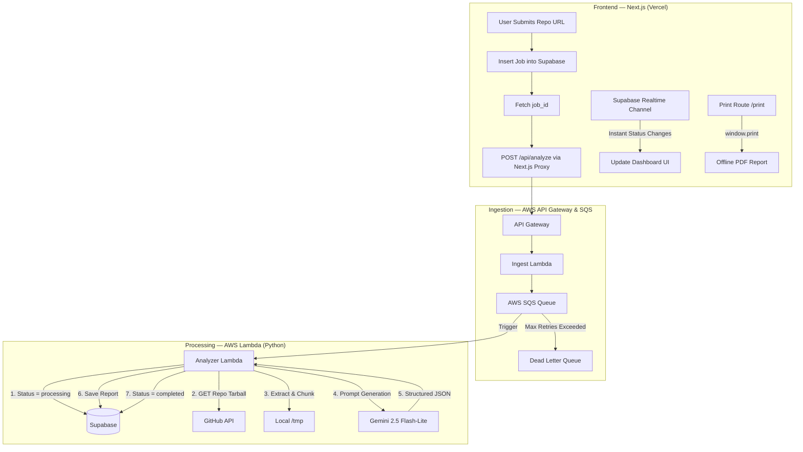

# 🏗️ System Architecture (VERA)

> [!NOTE]
> VERA (Viva Evaluation and Report Automator) utilizes a decoupled, event-driven, and serverless architecture. This document explains the internal mechanisms of how Phase 1 has been implemented.

## 🌟 End-to-End Execution Flow

Our processing pipeline ensures that the user's frontend remains highly responsive even while potentially expensive and time-consuming tasks (like downloading code and running AI analysis) are handled in the background.

## 🔍 Core Processing Components

### 1. Ingestion Layer (AWS SQS & API Gateway)
When a user submits a repository, the Next.js frontend first inserts a new job into Supabase to acquire a `job_id`. It then invokes the AWS API Gateway endpoint (`/api/analyze`) passing this `job_id` and repository details. 
To ensure immediate response to the client, a lightweight Lambda function handles the API request, immediately pushes the request onto an AWS SQS Queue (`viva-analysis-queue`), and returns a HTTP 202 Accepted.

### 2. AWS Lambda Analyzer (`handler.py`)
This is the core engine triggered directly by SQS messages. The architecture leverages AWS Lambda's ephemeral compute to process each repository in isolation.

#### Code Chunking Strategy (`code_chunker.py`)
- **Extraction:** The worker downloads a tarball of the GitHub repository into the Lambda's `/tmp` directory.
- **Filtering:** We aggressively filter out non-code directories (like `node_modules`, `venv`, `.git`) and binary files, retaining only strictly supported extensions (e.g., `.c`, `.cpp`, `.java`, `.py`, `.js`, `.ts`).
- **Safety Limits:** To protect against lambda timeouts and out-of-memory errors, we enforce strict limits:
  - Max repo size: 50MB
  - Max file count: 200 files
  - Individual files > 100KB are aggressively truncated.

### 3. AI Analysis Engine (`ai_engine.py`)
We leverage **Gemini 2.5 Flash-Lite** via the Google AI Studio REST API.
Instead of relying on fragile prompt engineering to structure the output, we enforce strict output structure using Gemini's `response_schema` parameter. By explicitly sending JSON schemas for our expected response (components list, flashcard questions, etc.), we guarantee the AI returns valid, parsable JSON matching our database shapes.

### 4. Stateful Storage & Realtime Updates (Supabase)
All long-term state lives in Supabase PostgreSQL:
- **Jobs Table:** Tracks execution status (`queued`, `processing`, `completed`, `failed`).
- **Reports Table:** Stores the final structured JSON results from the AI (including `architecture_summary`, `components`, `report_sections`, and `viva_flashcards`).
- **Row Level Security (RLS):** Secures the tables so users can only view results they initiated, while the Lambda backend uses a `service_role` key to bypass RLS for systemic updates.
- **Supabase Realtime (V2 Upgrade):** The client replaces polling with a live PostgreSQL Realtime subscription to `postgres_changes` on the `jobs` table filtered by `user_id`. Status changes are pushed instantly to the user interface, saving server resources and improving responsiveness.

## 🧪 Pipeline Validation & Testing (Phase 3)
To ensure the pipeline is robust and handles all edge cases safely:
- A unit test suite has been established under `backend/tests/`.
- Tests cover `repo_downloader` URL parsing (including edge-case formats), `code_chunker` path filtering, extraction limits, truncation logic, and `ai_engine` payload serialization.
- Local test execution runs completely offline by simulating payloads and mock responses.

## 🖨️ Offline PDF Export (V2 Upgrade)
A clean, print-friendly path `/report/[jobId]/print` parses and renders the entire document layout (Cover Page, Architecture Table, numbered Sections, and Flashcards with Follow-ups and Topic Tags) in high-contrast black-and-white. It automatically triggers `window.print()` upon render to invoke the browser's native PDF export dialog, bypassing layout shifts and scaling issues.

## ⚠️ Error Handling & Dead Letter Queue
Errors can happen at any phase (e.g., repo is private, repo too large, AI timeout). 
- **Managed Failures:** Known issues (like `RepoTooLargeError`) update the job status to `failed` gracefully, logging a clear `error_code` back to the database for the frontend to display.
- **Unexpected Failures:** Catastrophic crashes prevent the Lambda from acknowledging the SQS message. After 3 retries, the message is automatically moved to the **Dead Letter Queue (DLQ)** for later developer debugging.

